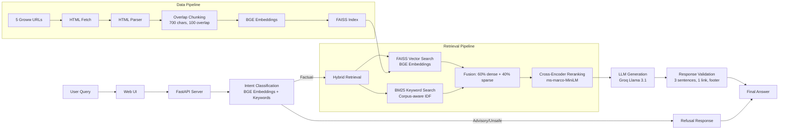

# Mutual Fund FAQ Assistant - RAG Prototype

A **facts-only** mutual fund FAQ assistant demonstrating **production-grade RAG architecture** using a fixed Groww corpus for five HDFC mutual fund schemes.

---

## 🎯 Project Goal

Build a RAG (Retrieval-Augmented Generation) system that:

- Answers **objective, verifiable questions** using only retrieved evidence
- **Refuses** advisory, comparative, speculative, or out-of-corpus requests
- Enforces strict **response contracts** (3 sentences, 1 citation, source date)
- Demonstrates **proper RAG components** (embeddings, vector search, reranking, LLM generation)

---

## 🏗️ RAG Architecture



---

## 🔧 Core RAG Components

### 1. **Embedding Model**: BGE Small (BAAI/bge-small-en-v1.5)

- **Type**: Dense bi-encoder
- **Dimensions**: 384
- **Framework**: FastEmbed (optimized ONNX runtime)
- **Usage**:
  - Query understanding (intent classification)
  - Document embeddings for vector search
  - Semantic similarity scoring

### 2. **Vector Index**: FAISS (Facebook AI Similarity Search)

- **Index Type**: `IndexFlatIP` (Inner Product on L2-normalized vectors = cosine similarity)
- **Storage**: Binary format (`faiss_index.bin`) + metadata JSON
- **Search**: Approximate nearest neighbor (ANN) for O(log n) retrieval
- **Why FAISS**: Industry standard for production vector search, supports billions of vectors

### 3. **Hybrid Retrieval**

```
Final Score = 0.6 * FAISS_Cosine_Similarity + 0.4 * BM25_Score
```

- **Dense (FAISS)**: Captures semantic meaning ("minimum investment" → "SIP amount")
- **Sparse (BM25)**: Captures exact keyword matches ("expense ratio", "exit load")
- **Fusion**: Weighted combination for best recall

### 4. **Cross-Encoder Reranking**

- **Model**: `cross-encoder/ms-marco-MiniLM-L-6-v2`
- **Purpose**: Precise query-document relevance scoring
- **How it works**:
  - Takes (query, document) pair as input
  - Outputs relevance score (typically [-10, 10])
  - More accurate than bi-encoder but slower
- **Standard RAG pattern**:
  1. Bi-encoder retrieves top 50-100 candidates (fast)
  2. Cross-encoder reranks to top 5-10 (accurate)

### 5. **BM25 Keyword Search**

- **Implementation**: Corpus-aware with proper IDF calculation
- **Formula**:
  ```
  IDF(t) = log((N - n(t) + 0.5) / (n(t) + 0.5) + 1.0)
  Score = IDF * (tf * (k1 + 1)) / (tf + k1 * (1 - b + b * |D|/avgdl))
  ```
- **Parameters**: k1=1.5, b=0.75 (standard values)

### 6. **LLM Generation**: Groq (Llama 3.1 8B)

- **Provider**: Groq API (ultra-fast inference)
- **Model**: `llama-3.1-8b-instant`
- **Temperature**: 0.0 (deterministic, factual)
- **Max tokens**: 150 (concise answers)
- **Prompt**: Facts-only instructions with retrieved context

### 7. **Intent Classification**

- **Primary**: Semantic similarity using BGE embeddings
- **Fallback**: Keyword matching for robustness
- **Categories**:
  - **Allowed**: expense_ratio, exit_load, minimum_sip, lock_in_period, riskometer, benchmark, document_download
  - **Refused**: investment_advice, comparison, ranking, return_projection, performance_calculation

---

## 📦 Tech Stack

| Component      | Technology                            | Purpose                      |
| -------------- | ------------------------------------- | ---------------------------- |
| Embeddings     | FastEmbed + BGE Small                 | Dense vector representations |
| Vector Search  | FAISS                                 | Efficient similarity search  |
| Keyword Search | Custom BM25                           | Lexical retrieval            |
| Reranking      | Sentence Transformers (Cross-Encoder) | Precision reranking          |
| LLM            | Groq (Llama 3.1)                      | Answer generation            |
| API            | FastAPI                               | REST API server              |
| UI             | Vanilla JS + CSS                      | Minimal web interface        |
| HTML Parser    | BeautifulSoup4                        | Web scraping                 |

---

## 🚀 Setup & Usage

### Prerequisites

- Python 3.9+
- Groq API key (for LLM generation)

### Installation

```bash
# Clone repository
git clone <repo-url>
cd pm-proj-rag

# Install dependencies
pip install -e .

# Set environment variables
echo "GROQ_API_KEY=your_key_here" > .env
```

### Data Pipeline

```bash
# 1. Ingest Groww pages (fetch, parse, chunk)
python scripts/ingest.py

# 2. Build FAISS index (embed chunks, create vector index)
python scripts/build_index.py
```

### Run the Application

```bash
# Start API server + UI
uvicorn src.pm_rag.api.server:app --reload --port 8000

# Open browser
http://localhost:8000
```

### Run Tests

```bash
python -m unittest discover -s tests
```

---

## 📊 Data Flow

### Ingestion Pipeline (Offline)

```
5 Groww URLs
  → HTML Fetch (requests)
  → HTML Parse (BeautifulSoup4)
  → Text Chunking (700 chars, 100 overlap)
  → BGE Embeddings (FastEmbed)
  → FAISS Index (IndexFlatIP)
  → Save: faiss_index.bin + metadata.json
```

### Query Pipeline (Online)

```
User Query
  → Intent Classification (BGE embeddings + keywords)
  → If allowed:
    → FAISS Search (top 10 candidates)
    → BM25 Search (lexical matching)
    → Fusion (60% dense + 40% sparse)
    → Cross-Encoder Reranking (top 5)
    → LLM Generation (Groq Llama 3.1)
    → Response Validation (3 sentences, 1 link, footer)
  → If refused:
    → Polite refusal message
```

---

## 🎯 Response Contract

Every answer must:

1. ✅ Stay within **3 sentences**
2. ✅ Include **exactly one source link** from the fixed 5-URL corpus
3. ✅ End with `Last updated from sources: <YYYY-MM-DD>`
4. ✅ Avoid investment advice, opinions, recommendations, return calculations

**Example Response**:

```
The HDFC Mid Cap Fund has an expense ratio of 0.73%. This is a direct plan growth option with no distributor commissions.
Source: https://groww.in/mutual-funds/hdfc-mid-cap-fund-direct-growth
Last updated from sources: 2026-05-29
```

---

## 📁 Project Structure

```
pm-proj-rag/
├── src/pm_rag/
│   ├── api/
│   │   └── server.py              # FastAPI server
│   ├── ui/
│   │   ├── index.html             # Web UI
│   │   ├── styles.css             # Styling
│   │   └── app.js                 # Frontend logic
│   └── core/
│       ├── ingestion/
│       │   ├── fetcher.py         # HTML fetcher
│       │   ├── parser.py          # HTML parser
│       │   ├── chunker.py         # Text chunking
│       │   └── pipeline.py        # Ingestion orchestration
│       ├── retrieval/
│       │   ├── faiss_index.py     # FAISS vector index ⭐
│       │   ├── embedder.py        # BGE embeddings ⭐
│       │   ├── keyword_search.py  # BM25 search ⭐
│       │   ├── reranker.py        # Rule-based reranking
│       │   ├── cross_encoder_reranker.py  # Cross-encoder ⭐
│       │   └── retriever.py       # Hybrid retrieval ⭐
│       ├── compliance/
│       │   ├── classifier.py      # Intent classification ⭐
│       │   ├── policies.py        # Allowed/refused policies
│       │   └── validators.py      # Response validation
│       ├── answering/
│       │   ├── prompts.py         # LLM prompts
│       │   ├── generator.py       # LLM generation ⭐
│       │   └── formatter.py       # Response formatting
│       └── sources/
│           └── catalog.py         # Corpus validation
├── configs/
│   └── corpus.yaml                # Fixed 5-URL corpus
├── data/
│   ├── raw/                       # HTML snapshots
│   ├── processed/                 # Chunks with metadata
│   └── indexes/                   # FAISS index + metadata
├── scripts/
│   ├── ingest.py                  # Run ingestion
│   └── build_index.py             # Build FAISS index
└── tests/                         # Phase-wise tests
```

---

## 🧪 What This Prototype Demonstrates

### ✅ Proper RAG Patterns

1. **Embedding-based retrieval** (not keyword-only)
2. **Vector database** (FAISS, not JSON file)
3. **Hybrid search** (dense + sparse)
4. **Cross-encoder reranking** (production pattern)
5. **Semantic intent classification** (not just regex)
6. **Response validation** (contract enforcement)

### ✅ Engineering Best Practices

1. **Modular architecture** (separation of concerns)
2. **Fallback mechanisms** (LLM → regex simulator)
3. **Corpus validation** (fixed source guardrails)
4. **Traceability** (source URLs, dates, metadata)
5. **Compliance gates** (pre/post generation checks)

---

## 🔒 Safety & Compliance

- **Fixed corpus only**: 5 Groww URLs, no external sources
- **No advisory responses**: Refuses "should I invest?", "which is better?"
- **No sensitive data**: Rejects PAN, Aadhaar, account number requests
- **Facts-only generation**: No hallucination, no opinions
- **Source attribution**: Every answer cites the exact Groww URL

---

## 📝 Known Limitations

1. **Small corpus**: Only 5 URLs (73 chunks) - designed for demonstration
2. **Single LLM provider**: Groq only (no fallback provider)
3. **No caching**: Every query re-runs embedding + LLM
4. **No rate limiting**: Not hardened for production traffic
5. **No monitoring**: No logging, metrics, or alerting

---

## 🎓 RAG Concepts Demonstrated

| Concept               | Implementation             | File                        |
| --------------------- | -------------------------- | --------------------------- |
| Dense Retrieval       | BGE embeddings + FAISS     | `faiss_index.py`            |
| Sparse Retrieval      | BM25 with corpus-aware IDF | `keyword_search.py`         |
| Hybrid Search         | Weighted fusion (60/40)    | `retriever.py`              |
| Reranking             | Cross-encoder ms-marco     | `cross_encoder_reranker.py` |
| Embedding Model       | BGE Small (384-dim)        | `embedder.py`               |
| Chunking              | Overlap-based (700/100)    | `chunker.py`                |
| Intent Classification | Semantic + keyword         | `classifier.py`             |
| LLM Generation        | Groq Llama 3.1             | `generator.py`              |
| Response Contract     | Validation layer           | `validators.py`             |
| Corpus Curation       | Fixed source catalog       | `corpus.yaml`               |

---

## 📄 License

This project is for educational/demonstration purposes.

---

## Disclaimer

Facts-only. No investment advice.

## Active Source Rule

Only the five exact Groww URLs listed in `configs/corpus.yaml` may be used. Do not add AMC pages, AMFI pages, SEBI pages, third-party pages, extra Groww pages, or links discovered from these pages.

## Selected Schemes

| #   | Scheme                                   | Category  | Source URL                                                                |
| --- | ---------------------------------------- | --------- | ------------------------------------------------------------------------- |
| 1   | HDFC Mid Cap Fund - Direct Growth        | Mid Cap   | https://groww.in/mutual-funds/hdfc-mid-cap-fund-direct-growth             |
| 2   | HDFC Equity Fund - Direct Growth         | Flexi Cap | https://groww.in/mutual-funds/hdfc-equity-fund-direct-growth              |
| 3   | HDFC Focused Fund - Direct Growth        | Focused   | https://groww.in/mutual-funds/hdfc-focused-fund-direct-growth             |
| 4   | HDFC ELSS Tax Saver - Direct Plan Growth | ELSS      | https://groww.in/mutual-funds/hdfc-elss-tax-saver-fund-direct-plan-growth |
| 5   | HDFC Large Cap Fund - Direct Growth      | Large Cap | https://groww.in/mutual-funds/hdfc-large-cap-fund-direct-growth           |
