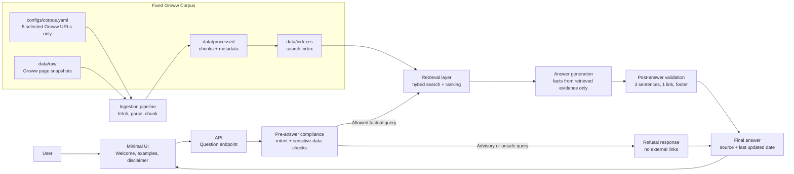

# Mutual Fund FAQ Assistant Architecture

## Overall Structure



## Product Goal

Build a facts-only mutual fund FAQ assistant that answers objective, verifiable questions about five selected HDFC mutual fund schemes using only the exact Groww URLs listed in this architecture and `configs/corpus.yaml`. The assistant must refuse advisory, comparative, speculative, privacy-sensitive, calculation-heavy, or out-of-corpus requests.

Every answer must:

- Stay within 3 sentences.
- Include exactly one source link from the fixed five-URL corpus.
- End with `Last updated from sources: <date>`.
- Avoid investment advice, opinions, recommendations, and return calculations.

## Guiding Principles

- Fixed corpus only: use the five selected Groww URLs and no other URLs.
- Retrieval first, generation second.
- Compliance gates before and after generation.
- One answer, one citation.
- Small corpus, high traceability.
- Source freshness is explicit.
- No collection or processing of PAN, Aadhaar, account numbers, OTPs, email addresses, or phone numbers.

## Code Organization

Production code is component-wise under `src/pm_rag/` because the same modules are reused across multiple phases. Tests and docs are phase-wise so evaluation can verify each milestone independently without forcing the runtime code into phase folders.

## Phase 0: Project Foundation

Purpose: establish the repo shape, shared constraints, and acceptance criteria.

Deliverables:

- `problemstatement.md`
- `architecture.md`
- `handoff.md`
- `README.md` with setup, selected schemes, architecture overview, known limitations, and disclaimer
- Initial file structure
- Phase 0 tests for fixed-corpus and documentation edge cases

Key decisions:

- Keep the system lightweight.
- Start with deterministic rules for policy and formatting.
- Use an implementation stack that supports simple local development, tests, and eventual deployment.

## Fixed Project Corpus

These five Groww URLs are the entire corpus for this project. Do not use AMC pages, AMFI pages, SEBI pages, third-party pages, extra Groww pages, or links discovered from these pages.

| # | Scheme | Category | Source URL |
|---|---|---|---|
| 1 | HDFC Mid Cap Fund - Direct Growth | Mid Cap | https://groww.in/mutual-funds/hdfc-mid-cap-fund-direct-growth |
| 2 | HDFC Equity Fund - Direct Growth | Flexi Cap | https://groww.in/mutual-funds/hdfc-equity-fund-direct-growth |
| 3 | HDFC Focused Fund - Direct Growth | Focused | https://groww.in/mutual-funds/hdfc-focused-fund-direct-growth |
| 4 | HDFC ELSS Tax Saver - Direct Plan Growth | ELSS | https://groww.in/mutual-funds/hdfc-elss-tax-saver-fund-direct-plan-growth |
| 5 | HDFC Large Cap Fund - Direct Growth | Large Cap | https://groww.in/mutual-funds/hdfc-large-cap-fund-direct-growth |

## Phase 1: Corpus Definition

Purpose: register the fixed Groww source universe before building retrieval.

Status: implemented as catalog validation in `src/pm_rag/core/sources/catalog.py`, backed by Phase 1 tests in `tests/test_phase1_corpus_definition.py`.

Inputs:

- AMC family: HDFC mutual fund schemes as represented by Groww pages.
- 5 category-diverse schemes: mid cap, flexi cap, focused, ELSS, and large cap.
- Exactly 5 Groww source URLs.

Source categories:

- Groww scheme pages only.
- No other source category is allowed in this project.

Outputs:

- `configs/corpus.yaml`: canonical list of AMC, schemes, source URLs, source type, and refresh date.
- Validated in-memory catalog records for the five schemes and five sources.

Acceptance criteria:

- Every source URL exactly matches one of the five approved Groww URLs.
- Each source has a document type, scheme mapping if applicable, and `last_checked` date.
- No third-party blogs, aggregators other than the five specified Groww pages, media articles, official AMC pages, AMFI pages, SEBI pages, or unofficial summaries are included.

## Phase 2: Ingestion Pipeline

Purpose: convert the five allowed Groww pages into clean, traceable chunks.

Status: implemented and run against the five live Groww URLs. Latest successful run: `20260529183625`, with 5 raw snapshots, 73 processed chunks, and 0 failures. Stable outputs are written to `data/raw/latest-manifest.json` and `data/processed/chunks-latest.json`.

Components:

- `src/pm_rag/core/ingestion/fetcher.py`: fetches only allowlisted Groww URLs.
- `src/pm_rag/core/ingestion/parser.py`: extracts text from Groww HTML snapshots and rejects blocked or low-content pages.
- `src/pm_rag/core/ingestion/chunker.py`: creates small chunks with metadata.
- `src/pm_rag/core/ingestion/pipeline.py`: coordinates fetch, raw snapshot writing, parse, scheme-focused filtering, chunking, failure capture, and processed output writing.
- `src/pm_rag/core/sources/catalog.py`: validates and loads source metadata.
- `scripts/ingest.py`: command-line ingestion entrypoint.

Chunk metadata:

- `source_url`
- `source_title`
- `source_type`
- `amc`
- `scheme`
- `document_date`
- `last_checked`
- `page_number` where available
- `section_heading` where available

Acceptance criteria:

- Raw snapshots are saved under `data/raw/<run_id>/`.
- Latest raw manifest is saved at `data/raw/latest-manifest.json`.
- Latest processed chunks are saved at `data/processed/chunks-latest.json`.
- Chunks preserve source URL and refresh date.
- Parser failures are reported clearly.
- No sensitive user data is ingested.
- The fetcher refuses any URL not present in `configs/corpus.yaml`.

## Phase 3: Retrieval Layer

Purpose: retrieve the most relevant Groww-corpus evidence for factual questions.

Components:

- `src/pm_rag/core/retrieval/embedder.py`: creates embeddings or normalized search vectors.
- `src/pm_rag/core/retrieval/index.py`: builds and loads the local retrieval index.
- `src/pm_rag/core/retrieval/search.py`: returns ranked evidence chunks.
- `data/indexes/`: local vector or keyword indexes.

Recommended approach:

- Start with a simple hybrid retrieval strategy: keyword search plus embeddings.
- Re-rank by source type and scheme match.
- Prefer exact scheme and document-type matches over generic education pages.

Acceptance criteria:

- Retrieval returns Groww-corpus-backed evidence for known factual questions.
- Query results include source URL and last checked date.
- Retrieval exposes enough metadata to enforce one citation in final output.

## Phase 4: Query Classification And Compliance

Purpose: block unsupported requests before retrieval or answer generation.

Components:

- `src/pm_rag/core/compliance/classifier.py`: classifies query intent.
- `src/pm_rag/core/compliance/policies.py`: central policy definitions.
- `src/pm_rag/core/compliance/validators.py`: validates final answer format.

Allow:

- Expense ratio.
- Exit load.
- Minimum SIP or lump sum amount.
- ELSS lock-in period.
- Riskometer.
- Benchmark index.
- Document download process.
- Tax statement or capital gains report process.

Refuse:

- "Should I invest?"
- "Which fund is better?"
- Rankings, recommendations, or comparisons.
- Return calculations or projections.
- Requests involving PAN, Aadhaar, account number, OTP, email, or phone number.

Performance-related rule:

- Do not calculate or summarize returns.
- Provide a short factual response with a link to the relevant Groww scheme page only.

Acceptance criteria:

- Advisory questions are refused politely.
- Refusals do not introduce external educational links; if a source link is required by the response contract, it must be one of the five Groww corpus URLs.
- Sensitive-data requests are rejected without storing the data.

## Phase 5: Answer Generation

Purpose: produce concise, factual, cited responses from retrieved evidence.

Components:

- `src/pm_rag/core/answering/prompts.py`: facts-only answer instructions.
- `src/pm_rag/core/answering/generator.py`: answer creation.
- `src/pm_rag/core/answering/formatter.py`: citation and footer formatting.

Answer contract:

```text
<1-3 sentence factual answer> Source: <groww_corpus_url>
Last updated from sources: <YYYY-MM-DD>
```

Generation rules:

- Use only retrieved evidence.
- Do not infer beyond source text.
- If evidence is insufficient, say the information was not found in the fixed Groww corpus.
- Include exactly one link.
- Keep the visible response to a maximum of 3 sentences plus footer.

Acceptance criteria:

- All answers pass final format validation.
- All source links come from the fixed five-URL Groww corpus.
- Unsupported facts trigger an insufficiency response, not hallucination.

## Phase 6: Minimal Interface

Purpose: provide a small user-facing surface for FAQ interaction.

Components:

- `src/pm_rag/ui/`: minimal web UI.
- `src/pm_rag/api/`: API endpoint for questions.

UI requirements:

- Welcome message.
- Three example questions.
- Visible disclaimer: `Facts-only. No investment advice.`
- Question input.
- Answer display with source and last updated footer.

Suggested example questions:

- What is the exit load for the selected scheme?
- What is the minimum SIP amount for the selected scheme?
- What is the lock-in period for the ELSS scheme?

Acceptance criteria:

- UI is clean and minimal.
- Disclaimer is always visible.
- No field asks for sensitive personal data.

## Phase 7: Evaluation And Tests

Purpose: prove the assistant follows the facts-only constraints.

Components:

- `tests/fixtures/`: sample queries and expected policy outcomes.
- `tests/test_compliance.py`: refusal and sensitive-data tests.
- `tests/test_retrieval.py`: retrieval quality tests.
- `tests/test_answer_format.py`: citation, footer, and sentence-limit tests.

Test sets:

- Factual allowed questions.
- Advisory refusal questions.
- Performance-related questions.
- Missing-information questions.
- Sensitive-data questions.

Acceptance criteria:

- 100% pass rate for response-format tests.
- Advisory and sensitive-data queries are consistently refused.
- Every successful answer includes exactly one source link from the five Groww URLs.

## Phase 8: Operations And Maintenance

Purpose: keep the corpus fresh and the project easy to hand over.

Operational files:

- `handoff.md`: compressed project state.
- `configs/corpus.yaml`: source catalog and refresh dates.
- `README.md`: setup, usage, selected AMC, schemes, known limitations.

Maintenance workflow:

1. Update `last_checked` dates in `configs/corpus.yaml` after refreshing the same five Groww URLs.
2. Run ingestion.
3. Rebuild retrieval index.
4. Run tests.
5. Update `handoff.md` with current project state.

Known limitations to document:

- Answers are limited to the curated corpus.
- Source documents may change without notice.
- The assistant does not provide investment, tax, legal, or financial advice.
- Performance queries are redirected to the relevant Groww scheme page rather than calculated.

## Target File Structure

```text
pm-proj-rag/
  src/
    pm_rag/
      api/
        .gitkeep
      core/
        answering/
          .gitkeep
        compliance/
          .gitkeep
        ingestion/
          fetcher.py
          parser.py
          chunker.py
          pipeline.py
        retrieval/
          .gitkeep
        sources/
          catalog.py
      ui/
        .gitkeep
  configs/
    corpus.yaml
  data/
    raw/
      .gitkeep
    processed/
      .gitkeep
    indexes/
      .gitkeep
  docs/
    .gitkeep
  scripts/
    .gitkeep
  tests/
    fixtures/
      .gitkeep
  architecture.md
  handoff.md
  problemstatement.md
  pyproject.toml
```
